# Installation

1. In Home Assistant, go to Configuration > Dashboards and press the "Add Dashboard" button. Choose a name and the URL for the dashboard. We will use ``echo-show`` as URL. 
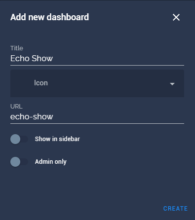

2. Open the dashboard click on "Edit Dashboard" in the top right corner. Tick the "Start with an empty dashboard" option and press "Take Control".
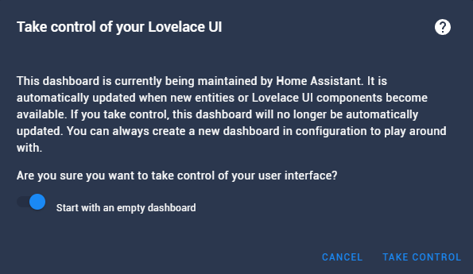

3. Edit the view "Home".

 Rename it if you want, and choose "1" as the URL.

4. You can now create as many views as you like, the only important thing is that you give them unique numbers as URLs just like in the previous step. You can also do this later if you want.

5. Now we're finished in Home Assistant. Open the [Alexa Developer Console](https://developer.amazon.com/alexa/console/ask) and sign-in with the Amazon account that is linked to your Echo Show.

6. I recommend switching the language of the Alexa Developer Console to "English (US)" in the bottom left corner. This will make following these instructions much easier.
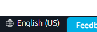

7. Click on "Create Skill".
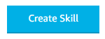

8. Enter a skill name (I chose "Dashboard Viewer") and make sure that the correct locale is selected (the language you use for your Echo Show). For the model select "Custom" and for the backend select "Alexa-hosted (Python).

9. In the top right corner adjust the hosting region to something that is close to you and press "Create skill" 
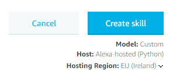

10. On the next page make sure "Start from Scratch" is selected and press "Continue with template".

11. You should now be on this page. 
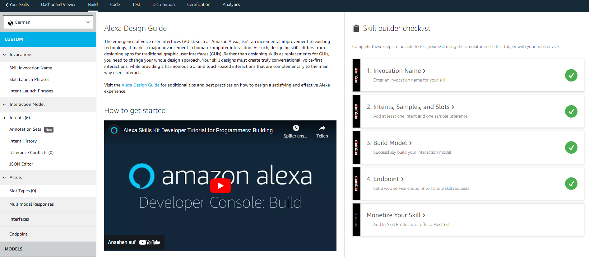

12. In the menu on the left select "Invocations" > "Skill Invocation Name". Here you can set the name of your skill. You will use this name to call the skill. We will use "dashboard viewer", however, if the language of your Alexa device differs from English it might be useful to choose something in your language (Alexa might not understand it otherwise). 
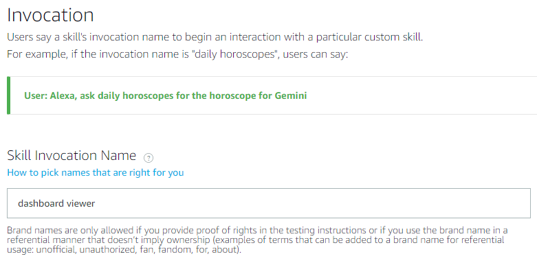

13. Again in the left menu select "Interaction Model" > "Intents". Delete the "HelloWorldIntent", we won't need it. Click on the "Add Intent" button. Select "Create custom intent" and choose ``OpenPageIntent`` as its name. Press on "Create custom intent" afterwards.
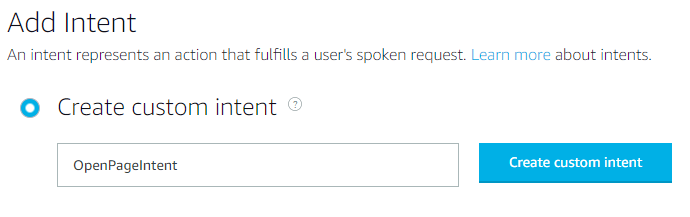

14. On the next page first scroll down to "Intent Slots". Use ``page`` as the name for the slot and click on "+" to add it. As "Slot Type" select ``AMAZON.NUMBER``. 
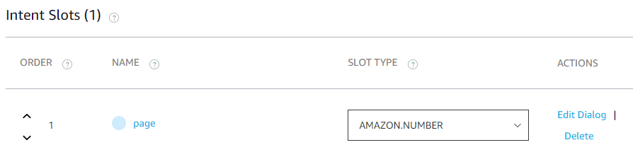

15. Then scroll up to "Sample Utterances". Here you can choose the command that is used to call the skill. We will use `open page {page}`. The ``{page}`` is a placeholder for a number which will later be used to open the respective view of the dashboard. You add the "utterance" by clicking on the "+" on the right. Again, if the language of your Alexa device differs from English you should choose a command in your language. The only important thing is that you use the placeholder ``{page}`` appropriately. It should be highlighted if everything is correct. 
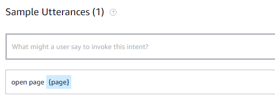

17. On the top click "Save Model". 
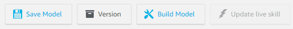

16. Again in the left menu navigate to "Interfaces". Activate the option "Alexa Presentation Language".
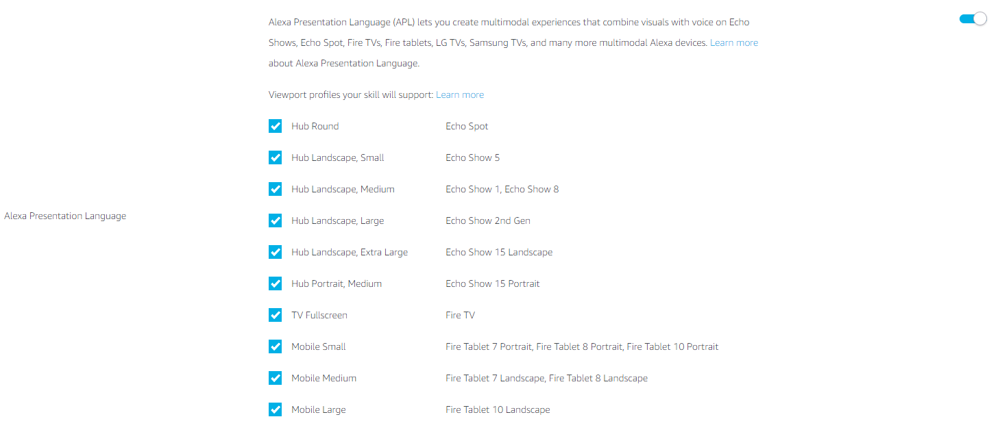

16. Click on "Save Interfaces". Then click "Build Model".
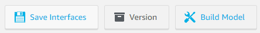

18. Wait until you get the notification "Build Completed". Afterwards navigate to the Code tab.
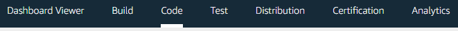

19. In the code editor replace the content of the ``lambda_function.py`` file with the content of the ``lambda_function.py`` file from this repository. It can be found [here](lambda_function.py). Change the ``DASHBOARD_URL`` variable according to step 1: We chose ``echo-show`` as URL in the first step. Assuming our Home Assistant URL is ``https://homeassistant.local:8123``, the ``DASHBOARD_URL`` should be ``https://homeassistant.local:8123/echo-show/``. I use [Kiosk Mode](https://github.com/maykar/kiosk-mode) to hide the header and sidebar drawer from Home Assistant. If you have [Kiosk Mode](https://github.com/maykar/kiosk-mode) installed you can use the ``KIOSK_MODE`` variable to enable/disable Kiosk mode. If you don't have [Kiosk Mode](https://github.com/maykar/kiosk-mode) installed, this option won't have any effect, therefore you can set it to ``False``. When you are finished, click on "Save". 
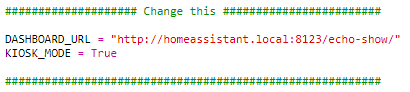

20. Right-click on the ``lambda`` folder and select "Create File". 
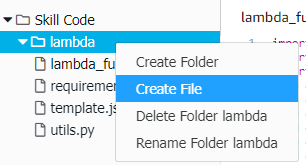

21. Select ``lambda/template.json`` as file path. 
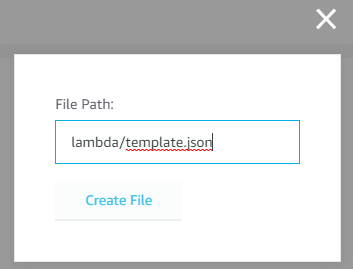

22. Paste the contents of the ``template.json`` from this repository (which can be found [here](template.json)) into the newly created ``template.json`` file. 
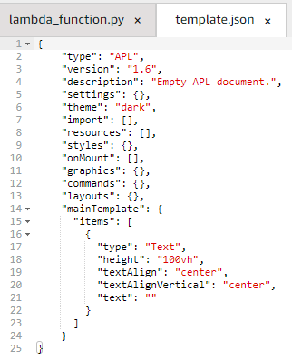

23. Click on "Save" and on the "Deploy" button. Wait until you get the notification "Deployment Successful". 
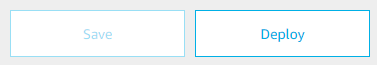

24. Navigate to the "Test" tab. 
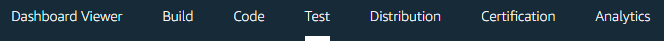

25. Select "Skill testing is enabled in: Development" from the dropdown and you are done 🎉. 
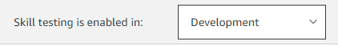

26. You can test the skill by opening it on your Alexa device. Since we chose  ``dashboard viewer`` as the invocation name, we would open the skill by saying ``Alexa, open dashboard viewer``. This should open the default view of the dashboard. If you never signed in to your Home Assistant account on your Echo Show, you might need to do this then. Make sure to select the "keep me logged in" option because you don't want to this every time you open this skill. When this works, you can test out if the view selection works. According to our utterance from step 14 we would need to say ``Alexa, tell dashboard viewer open page <number>``, where ``<number>`` is the URL of the view you want to open. Of course you would need to create such a view first; this is described in step 4.
